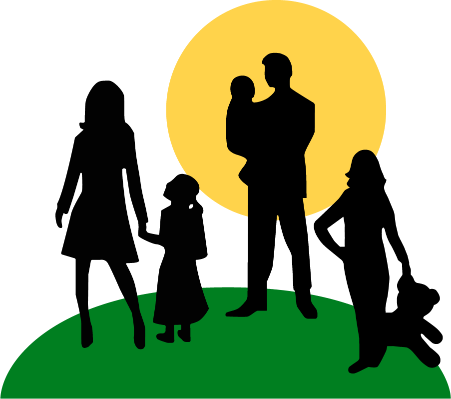

# Island_of_opportunity

[![Contributors][contributors-shield]][contributors-url]
[![Forks][forks-shield]][forks-url]
[![Stargazers][stars-shield]][stars-url]

<!-- PROJECT LOGO -->
 

  

  <h3 align="center">Остров возможностей</h3>

  

    Твоя позитивная мотивация пройти курс до конца
     
    <a href="https://archik-k.github.io/Training-card/"><strong>Explore GitHub Pages »</strong></a>
     
     
  

<!-- TABLE OF CONTENTS -->

  
Содержание

  <ol>
    <li>
      <a href="#о-проекте">О проекте</a>
      <ul>
        <li><a href="#инструменты">Инструменты</a></li>
      </ul>
    </li>
    <li><a href="#демонстрация">Демонстрация</a></li>
    <li><a href="#наша-команда">Наша команда</a></li>
  </ol>

<!-- ABOUT THE PROJECT -->
## О проекте

![][product-screenshot]

Этот проект был выполнен для хакатона ITGirls School 28.10.2023

Идея проекта:
* Как показывают исследования, показатель COR (Completion Rate) длительных онлайн курсов достаточно низкий. Бесплатные курсы успешно проходят до конца не более 13% студентов, но чаще этот показатель не превышает 4-5%, платные курсы без дополнительного сопровождения оканчивают не более 45%, с сопровождением - не более 80%. 
* Студенты бросают курс или откладывают обучение из-за недостатка мотивации.
* Этот проект был вдохновлён идеей помочь тем, кому сложно учиться, через мотивацию заботы о животных.
* Мы предлагаем ученикам онлайн курсов подключить пожертвование приюту для животных (из числа партнёров проекта) и выполнять задания курса для выполнения переводов пожертвований.
* Для получения обратной связи, мы предлагаем пользователю подписаться на рассылку с новостями наших партнёров.
* Так же возможно добавление во всплывающие окна при прохождении блока обучения и всего курса  фото и видео с питомцами из приютов для дополнительной моральной мотивации.

Что было сделано:
* Разработан общий дизайн внешнего вида с подбором цветовой гаммы. шрифтов, расположениями блоков и надписей.
* Создан прототип карты прохождения обучения с модальным окном для заполнения прогресса обучения.
* На данном этапе проект представляет из себя концепцию с рабочими блоками для демонстрации.

Что можно доработать:
* Карта прохождения курса является динамическим объектом и может быть дополнена новыми пунктами при необходимости.
* Добавление мотивационных фото и видео, всплывающих при прохождении пользователем заданий, блоков, всего курса.
* Доработка кода для обеспечения кроссбраузерности сайта.
* Доработка кода для обеспечения адаптивности сайта на различных устройствах.

(<a href="#readme-top">back to top</a>)

### Инструменты

В этом проекте мы использовали:
 

    
    
    
    

(<a href="#readme-top">back to top</a>)

<!-- USAGE EXAMPLES -->
## Демонстрация 
 
 

<i>Страница регистрации пользователя</i>
   
   
    
     
     
     
     
<i>Страница выбора онлайн курса</i>
   
   
    
     
     
     
     
<i>Страница с картой прохождения курса</i>
   
   
    
     
     
     
     
<i>Модальное окно с прогрессом выполнения заданий</i>
   
   
    

Вы можете получить опыт использования сайта по ссылке 
<a href="https://archik-k.github.io/Training-card/">Study for save
  </a>

(<a href="#readme-top">back to top</a>)

<!-- CONTACT -->
## Наша команда

Ася - [GitHub](https://github.com/Archik-K)

Ирина - [GitHub](https://github.com/eireensid)

Анна - [GitHub](https://github.com/HannaTsilikina)

Ирина - [GitHub](https://github.com/BarhatovaIrina)

Алёна - [GitHub](https://github.com/bearcubbb)

Татьяна - [GitHub](https://github.com/KruTatiana)

(<a href="#readme-top">back to top</a>)

<!-- MARKDOWN LINKS & IMAGES -->
<!-- https://www.markdownguide.org/basic-syntax/#reference-style-links -->
[contributors-shield]: https://img.shields.io/badge/CONTRIBUTORS-6-%2330201c?style=for-the-badge&labelColor=%23ebd1a0&color=%2330201c
[contributors-url]: https://github.com/Archik-K/Training-card/graphs/contributors
[forks-shield]: https://img.shields.io/badge/FORKS-%23ebd1a0?style=for-the-badge&labelColor=%23ebd1a0
[forks-url]: https://github.com/Archik-K/Training-card/forks
[stars-shield]: https://img.shields.io/badge/STARS-%23ebd1a0?style=for-the-badge&labelColor=%23ebd1a0
[stars-url]: https://github.com/Archik-K/Training-card/stargazers
[product-screenshot]: ./assets/images/readme_img/product-name-screen-shot.png
